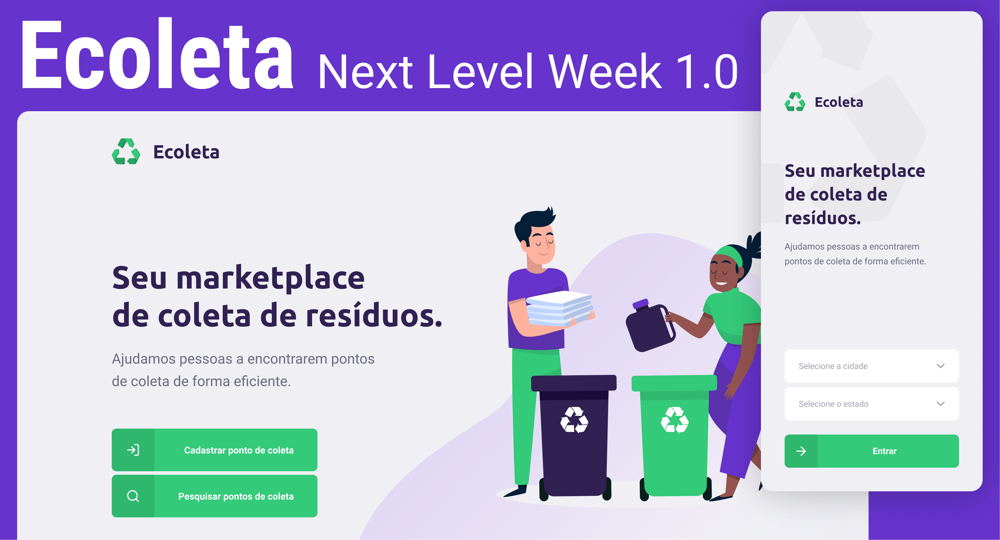

<h1 align="center">
    
</h1>

<p align="center">
    <a href="#camera--screenshots-iphone--computer">Screenshots</a> •
    <a href="#--technologies">Technologies</a> •
    <a href="#hammer_and_wrench--features">Features</a> •
    <a href="#video_game--usage">Usage</a> •
    <a href="#writing_hand--author">Author</a> •
    <a href="#memo--license">License</a>
</p>

<p align="center">
    Ecoleta is a project developed during the first Rocketseat's <i>Next Level Week</i> (NLW). The NLW happened during the enviroment week, so it has the purpose to help people to register and search for recycling collection point. This project was devoped using the Typescript development stack, which is detailed bellow.
</p>

## :camera: &nbsp; Screenshots (:iphone: + :computer:)

 


## 🚀 &nbsp; Technologies

This project was developed with the following technologies:

<p align="center">
    
    
    
    
    
</p>

## :hammer_and_wrench: &nbsp; Features

### :globe_with_meridians: &nbsp; Api

* [x] Routes
    * [x] List items `GET: /items`
    * [x] List points `GET: /points`
    * [x] Get a point by id `GET: /points/<id>`
    * [x] Create a point `POST: /points`
* [ ] Create an API documentation 

### :computer: &nbsp; Web

* [x] Routes
    * [x] Home
    * [x] Search
    * [x] Create
    * [x] Success
* [x] Improvements
    * [x] Implementation of selected items using a `Set`
    * [x] Creation of the environment file to define the API's endpoints
    * [x] Modularization of the project to use constans and a models directory

### :iphone: &nbsp; Mobile

* [x] Screens
    * [x] Points search with city and state filtering
    * [x] Listing points nearest mobile location
    * [x] Detailing of a point
* [x] Improvements
    * [x] Implementation of selected items using a `Set`
    * [x] Modularization of the project to use constans and a models directory

## :video_game: &nbsp; Usage

### :globe_with_meridians: &nbsp; Api
<details>
<summary>The instructions below shows how to install dependencies and to execute the api.</summary>
    
```shell
cd server
npm install
npm run dev
```
</details>

### :computer: &nbsp; Web
<details>
<summary>The instructions below shows how to install dependencies and to execute the webpage.</summary>
    
```shell
cd web
npm install
npm start
```
</details>

### :iphone: &nbsp; Mobile
<details>
<summary>The instructions below shows how to install dependencies and to execute the mobile application.</summary>
    
```shell
cd mobile
npm install
npm start
```
</details>


## :writing_hand: &nbsp; Author

[<br /><sub>Vinicius Campos</sub>](http://lattes.cnpq.br/4806707968253342)<br />[👀](https://github.com/Vinihcampos/ecoleta/commits?author=Vinihcampos)
| :---: | 

## :memo: &nbsp; License

This project is licensed under the MIT License - see the [LICENSE.md](LICENSE) file for details
